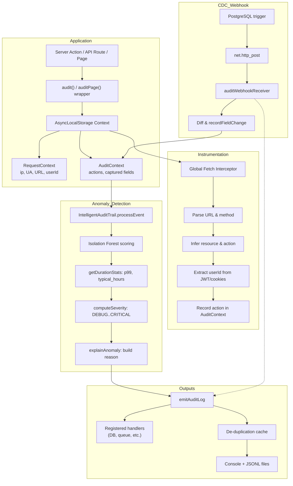

# 🛡️ Intelligent Audit Trail

> Explainable, safe, and framework‑agnostic audit logging with ML‑powered anomaly detection.

[](https://www.typescriptlang.org/)
[](https://nextjs.org/)
[](https://nodejs.org/)
[](https://deno.com/)

---

## ✨ Features

| Feature | Description |
|---------|-------------|
| **🧠 Explainable Anomalies** | Anomalous logs contain `p99_duration_ms`, `typical_hours`, `deviation`, and a plain‑English `reason` (e.g., *"hour 15 is outside typical hours [0,2,16,17]"*). No more mystery scores. |
| **🔒 Safe by Design** | Field‑level before/after values (`oldValue`/`newValue`) and full payloads are **never** logged unless explicitly opted‑in via `auditRules` + `recordFieldChange`. Sensitive keys (`password`, `token`) are automatically redacted. |
| **⚡ Zero‑Boilerplate Instrumentation** | Automatic fetch interceptor detects outbound calls (Supabase, REST, GraphQL, microservices) and infers `resource`/`action` from the URL and HTTP method. |
| **🌐 Framework‑Agnostic** | Works with Next.js (App Router), Express, Fastify, Hono, Cloudflare Workers, Deno, and even the browser (via `AsyncLocalStorage` polyfill). |
| **🗄️ Database CDC Webhook** | Consumes PostgreSQL/MySQL trigger payloads via `auditWebhookReceiver`. Inject `oldValue`/`newValue` diffs directly into your audit trail – **without touching application code**. |
| **🔗 Smart Context Propagation** | `setCurrentPath` in middleware ensures Server Actions inherit the correct page route (`/dashboard`). Stack‑trace sniffing recovers URLs when Next.js strips headers. |
| **♻️ De‑duplication** | Sliding‑window cache collapses duplicate logs for the same user/resource/action (e.g., an API route calling an outbound microservice) within 4 seconds. |
| **🧪 ML‑Powered Scoring** | Isolation Forest trained on your baseline (with synthetic duration outliers). Auto‑calibrated threshold (98th percentile) – zero manual tuning. |

---

## 📦 Installation

```bash
npm install intelligent-audit-trail
# or
yarn add intelligent-audit-trail
# or
pnpm add intelligent-audit-trail
```

---

## 🚀 Quick Start

### 1. Train the Model (Collect Baseline)

Set your app to `TRAINING` mode and run it under normal load:

```ts
// instrumentation.ts (Next.js) or your entry file
import { auditTrail } from 'intelligent-audit-trail';

auditTrail.setMode('TRAINING'); // logs written to audit-baseline.jsonl
```

### 2. Load Baseline & Switch to Production

Once you have a representative baseline file:

```ts
// instrumentation.ts
import { auditTrail } from 'intelligent-audit-trail';

await auditTrail.loadBaseline('audit-baseline.jsonl'); // trains model, switches to PRODUCTION

auditTrail.onLog(async (log) => {
  await db.insert(auditLogs).values(log); // forward to your database
});
```

### 3. Wrap Your Code

**Server Action** (auto‑detects context):

```ts
'use server';
import { audit } from 'intelligent-audit-trail';

export const updateArticle = audit(
  async function updateArticle(id: string, data: any) {
    const before = await db.article.findUnique({ where: { id } });
    const updated = await db.article.update({ where: { id }, data });

    // Opt‑in field change capture (requires auditRules config)
    recordFieldChange('articles', 'status', before?.status, updated.status);

    return updated;
  },
  { resource: 'Article' } // functionName auto‑inferred as 'updateArticle'
);
```

**API Route** (detects `Request` automatically):

```ts
// app/api/analyze/route.ts
import { audit } from 'intelligent-audit-trail';

export const POST = audit(
  async function analyzeRoute(request: Request) {
    const body = await request.json();
    const response = await fetch('http://localhost:10000/analyze', {
      method: 'POST',
      body: JSON.stringify(body),
    });
    return Response.json(await response.json());
  },
  { resource: 'Analyze' }
);
```

**Page (Server Component)** – requires middleware for Server Action path inheritance:

```tsx
// app/dashboard/page.tsx
import { auditPage } from 'intelligent-audit-trail';

async function DashboardPage() {
  const user = await getUser();
  return <DashboardClient user={user} />;
}

export default auditPage(DashboardPage, { resource: 'Dashboard' });
```

**Middleware (required for Server Actions)**:

```ts
// middleware.ts
import { NextResponse, type NextRequest } from 'next/server';
import { setCurrentPath } from 'intelligent-audit-trail';

export function middleware(request: NextRequest) {
  setCurrentPath(request.nextUrl.pathname); // propagates route to Server Actions
  return NextResponse.next();
}
```

---

## 🔒 Opt‑In Field Capture (Security First)

**Nothing is logged unless you explicitly allow it.**

Define rules per table/resource:

```ts
// config/audit.ts
import { auditRules } from 'intelligent-audit-trail';

auditRules.articles = {
  captureTableName: true,
  fields: {
    title:  { capture: true, maxLength: 200 },
    status: { capture: true },
    // 'content' intentionally omitted – never logged
  },
};

auditRules.users = {
  captureTableName: true,
  fields: {
    role:     { capture: true },
    email:    { capture: false, redact: true }, // don't store plain email
    password: { redact: true }, // never logs the value, even if captured
  },
};
```

Then in your action:

```ts
recordFieldChange('articles', 'status', before?.status, updated.status);
```

→ Only fields with `capture: true` will appear in the log as `tableName`, `fieldName`, `oldValue`, `newValue`, and `recordId`.

---

## 🗄️ Database CDC Webhook (Zero‑Application‑Code Auditing)

This is the **crown jewel** – capture every database change made via SQL consoles, direct queries, or external ETL tools.

### 1. Create the PostgreSQL Trigger

```sql
-- Create the trigger function
CREATE OR REPLACE FUNCTION public.notify_nextjs_audit_webhook()
RETURNS TRIGGER AS $$
DECLARE
  payload JSONB;
BEGIN
  IF TG_OP = 'INSERT' THEN
    payload := jsonb_build_object(
      'tableName', TG_TABLE_NAME,
      'operation', TG_OP,
      'oldRecord', NULL,
      'newRecord', to_jsonb(NEW)
    );
  ELSIF TG_OP = 'DELETE' THEN
    payload := jsonb_build_object(
      'tableName', TG_TABLE_NAME,
      'operation', TG_OP,
      'oldRecord', to_jsonb(OLD),
      'newRecord', NULL
    );
  ELSE -- UPDATE
    payload := jsonb_build_object(
      'tableName', TG_TABLE_NAME,
      'operation', TG_OP,
      'oldRecord', to_jsonb(OLD),
      'newRecord', to_jsonb(NEW)
    );
  END IF;

  -- Call the Next.js webhook endpoint
  PERFORM net.http_post(
      'https://your-app.com/api/audit-webhook'::text,
      payload,
      '{}'::jsonb,
      '{"Content-Type": "application/json"}'::jsonb,
      5000::integer
  );

  RETURN COALESCE(NEW, OLD);
END;
$$ LANGUAGE plpgsql;

-- Attach to your tables
CREATE TRIGGER audit_profiles_trigger
AFTER INSERT OR UPDATE OR DELETE ON public.profiles
FOR EACH ROW EXECUTE FUNCTION public.notify_nextjs_audit_webhook();
```

### 2. Mount the Receiver in Next.js

```ts
// app/api/audit-webhook/route.ts
import { auditWebhookReceiver } from 'intelligent-audit-trail';

export const POST = auditWebhookReceiver; // ✅ fully wired – diffs and logs every change
```

**What happens automatically:**
- The receiver maps aliases (`tableName`, `oldRecord`, `newRecord`).
- It diffs every changed column using `recordFieldChange`.
- The audit trail picks up `tableName`, `fieldName`, `oldValue`, `newValue`, and `recordId`.

> **⚠️ Important:** The raw trigger does **not** forward the authenticated user ID.  
> To populate `userId`, modify the trigger to include `auth.uid()` or `current_setting('request.jwt.claim.sub')` in the payload – otherwise, all CDC logs will have `userId: null`.

---

## 🧠 Explainability – What an Anomalous Log Looks Like

```json
{
  "severity": "ERROR",
  "anomalyScore": 0.6759,
  "message": {
    "summary": "Failed to read Auth via getUser after 163ms",
    "duration_ms": 163,
    "p99_duration_ms": 11115,
    "typical_hours": [0, 2, 16, 17],
    "deviation": "-99%",
    "reason": "hour 15 is outside typical hours [0,2,16,17] for Auth/READ"
  }
}
```

- **Operators** see exactly *why* it was flagged.
- **Dashboards** can render `reason` directly – no re‑querying required.
- **Novel resource/action** pairs get a fallback reason: *"No baseline for Analyze/CREATE — anomaly based on novelty"*.

---

## 🔧 Advanced API

| Function | Purpose |
|----------|---------|
| `audit(fn, options)` | Unified wrapper – auto‑detects API route vs server action. |
| `auditPage(page, options)` | Wraps Server Components (pages). Requires `setCurrentPath` in middleware. |
| `setCurrentPath(path)` | Injects `urlPath` into async context – used in middleware. |
| `captureRequestContext(req, fn)` | Explicit context capture for Express/Hono. |
| `recordFieldChange(table, field, old, new, recordId?)` | Opt‑in before/after capture. |
| `recordPayload(resource, payload)` | Opt‑in full payload capture (size‑capped, sanitised). |
| `getAuditContext()` | Retrieves current `AuditContext` and `RequestContext` for debugging. |
| `auditTrail.onLog(handler)` | Forward logs to DB, queue, or monitoring. |
| `auditTrail.loadBaseline(source)` | Train model from JSONL file or array. |
| `auditTrail.setMode('TRAINING' / 'PRODUCTION')` | Switch modes. |

---

## 🧪 Anomaly Detection Details

- **Model**: Isolation Forest (100 trees).
- **Features**: `[hour, actionVal, resourceVal, log2Duration × 4]`.
- **Training**: Baseline events + synthetic outliers (3×–10× max duration) to teach the model that extreme latency is anomalous.
- **Threshold**: Auto‑calibrated at the 98th percentile of baseline scores + margin (0.015).
- **Explainability**: Per‑`resource:action` profiles (`p99` duration, typical hours) built from the baseline – used exclusively for the `reason` field, never for scoring.

---

## 🏗️ Architecture Overview



---

## 🤝 Contributing

Contributions are welcome! Please open an issue or PR for:

- Additional framework adapters (NestJS, Koa, etc.).
- Async file writer (to replace sync `appendFile`).
- Built‑in Slack/PagerDuty alerts for `CRITICAL` events.

---

## 📄 License

MIT © 2025

**Built with ❤️ for developers who hate mystery alerts.**
